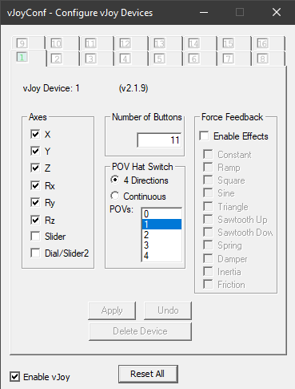
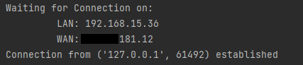
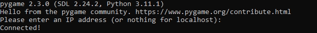

# JoystickOverTCP-IP
A Client/Server application for transmitting joystick controlls over any network
Add net play to any 2 player game or console emulator when used inconjunction with video stream / screenshare.

# Notes
This application requires that the host/server computer have [vJoy](https://github.com/shauleiz/vJoy) installed.
 
This application communicates on port 5000 (can be changed easily in source code), if computers are behind a firewall and/or router this port most likely will need to be opened and forworded.
 
Compiled executables in /dist folder are win64

# Seting up vJoy
To run this application the Host/Server must install [vJoy](https://github.com/shauleiz/vJoy) to emulate a native game controller. It will use the first vJoy device slot without altering the python script.
The application is currently configured to reproduce the buttons, axes and d-hat of a PlayStation DualShock or XBox controller. vJoy must be configured to support 6 axes, 11 buttons and 1 four direction POV hat switch (as shown below).

# How to use joyServer
If running from script you will require the python libraries: pyvjoy, socket, ast, urllib.request.

Once run, you will see a message indicating that you are awaiting a connection and your outward facing IP addresses. The Client will need to enter your address into their application. When the Client successfully establishes a connection you will see an onscreen notification.

# How to use joyClient
If running from script you will require the python libraries: pygame, socket, ipaddress, time

This app uses your primary game controller by default, change with windows settings or run from script to select your input device. Once run you will be required to enter the address of the host/server. If you then receive a "Connected!" message you should be good to go.

